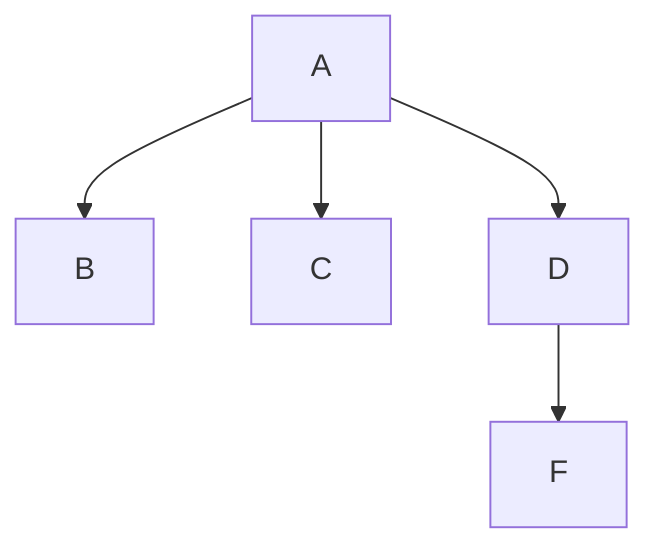
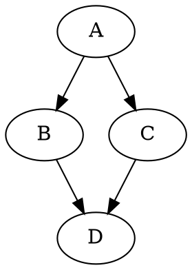

# First Level Heading `<h1>`

First Level Heading
==

## Second Level Heading
Second Level Heading by --
--

### Third Level Heading
#### Forth Level Heading
##### Fifth Level Heading
###### Sixth Level Heading

<!-- Page Break -->
<div style="page-break-after: always;"></div>
## Italic Text `(<em>)`
this is a *italic* text.
this is a _italic_ text.

## Bold Text `(<strong>)`
this is a **bold** text.
this is a __bold__ text.


## Blockquote `(<blockquote>)`
>to be or not to be

## Line Break `(<br>)`
2 spaces at the end of a line  
produces a line break.


## Horizontal Rule `(<hr>)`
___
---
***
_ _ _
- - -
* * *

## Unordered Lists `(<ul>)`
* item 1
  * item 1-1
  * item 1-2
* item 2
* item 3

-  item 1
  - item 1-1
  - item 1-2
- item 2
- item 3

## Ordered Lists `(<ol>)`
1. item 1
3. item 2
1. item 3

## Links `(<a>)`
This is a link to [Google](https://google.com (My Tooltip Text)).  
The Google website is <http://google.com>.  
My Email: <me@mail.com>

This is a **Reference Link** to [Google][mySite].

[mySite]:https://google.com "My Second Tooltip Text"

## Images `()`
)

![My Alt Text][myIcon].

[myIcon]:https://markdown-here.com/img/icon64.png "64*64 Icon"


## Image inside Link

[](https://google.com (My Tooltip Text))


## GFM (Github Flavored Markdown) Modifications
* Ignore underscores
* Strikeout `(~~style~~)`
* Task Lists `[x]`
* Auto-hotlinking *(no need for angle brackets)*
* Fenced CodeBlocks
* Tables     

## Strikeout Text `(<style>)`
~~This is a strikeout text.~~

## Inline Code  `(<code>)`
The command `mv` is used for rename files.

## Code Block `(<pre><code>)`
Tabs or 4 Spaces in front of paragraph rendered as code block.

    function sum(a,b){
      ...
    }

## Fenced Code Block
```
function sum(a,b){
  return a+b;
}
```

```javascript      
function sum(a,b){
  return a+b;
}
```

## Table  `(<table>)`
| Header One | Header Two | Header Tree |
| :--------: | :--------- | ----------: |
|   Item 1   | Item 2     |      Item 3 |
|   Item 1   | Item 2     |      Item 3 |
|   Item 1   |            |      Item 3 |

## Task Lists
- [x] Task 1
- [x] Task 2
- [x] Task 3
- [ ] Task 4

## Scape Sequence
\*This text is not italic\*

## Use HTML code inside Markdown
<u>An example of using u tag inside markdown </u>
<div style="color:red">AAA</div>
<style>
  p{color:lightblue}
</style>

## Table of contents
[TOC]

## Footnote `(Pandoc)`
This is a reference to the video [^note]

[^note]: Youtube - Academic Writing in Markdown (Nicholas Cifuentes Channel - Dec 10, 2016)

## Table Caption `(R Markdown) `
| Header One | Header Two | Header Tree |
| :--------: | :--------- | ----------: |
|   Item 1   | Item 2     |      Item 3 |
|   Item 1   | Item 2     |      Item 3 |
|   Item 1   |            |      Item 3 |

Table: This is caption


## Diagrams


